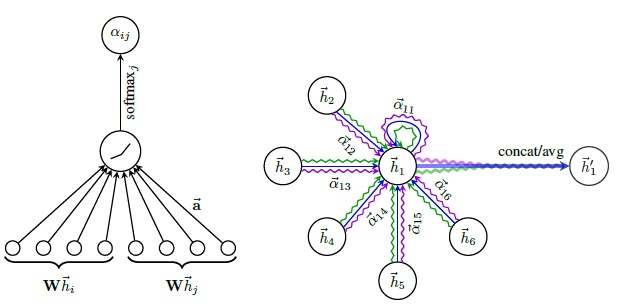
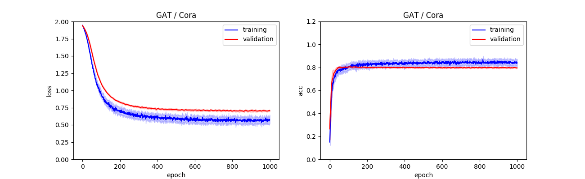
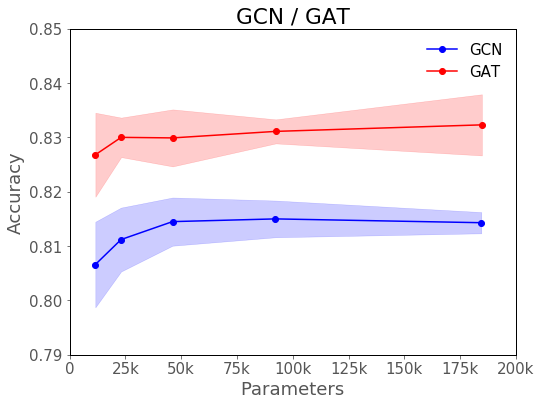
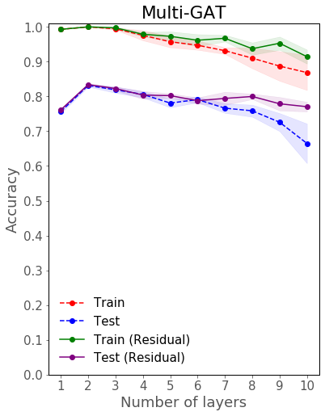

# Graph Attention Networks



## Results

| Dataset | Test Accuracy | Reported Accuracy |
| :-: | :-: | :-: |
| Cora | 83.4 +- 0.3% | 83.0 +- 0.7% |
| Citeseer | 71.6 +- 0.6% | 72.5 +- 0.7% |
| Pubmed | 78.3 +- 0.4% | 79.0  +- 0.3% |

## Reproduce

Use the following command to train a GAT model trained on Cora dataset with default parameters to reproduce the result in the paper: [Graph Attention Network](https://arxiv.org/pdf/1710.10903.pdf).

```
$ python train.py accuracy --dataset=cora  --gpu=True
```

You can set different dataset in the argument `--dataset` to reproduce other results. See help for more setting.

Once the training is completed, there would be a model file called `gat_{dataset}.pth`, and an image called `gat_{dataset}.png` which visualizes loss and accuracy during the training. The accuracy on test set can be seen at the tail of output on your terminal.



## Compare with GCN

Type the following command to run the comparison between GCN and GAT at different model parameters.

```
$ python train.py parameters --dataset=cora --gpu=True
```



The above figure shows that GAT is almost better than GCN.

## Multi-layer GAT

Use the following command to train a multi-layer GAT model with or without residual connections:

```
$ python train.py layers --dataset=cora  --gpu=True
```

It will train two GAT models, one with residual connections and the other without residual connections.

Once the training is done, an image showing the different between these two models will be saved as `multi_gat.png`.



Like multi-layer GCN, multi-layer GAT can not get benefit by increasing its depth. However, the decrease of multi-layer GAT is smaller than that of multi-layer GCN. It may be caused by attention mechanism. Again, there is no improvement when adding residual connections.
