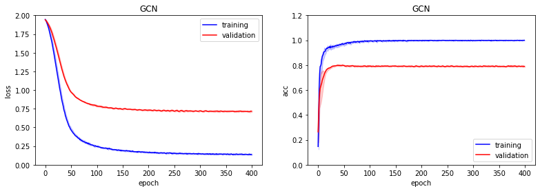
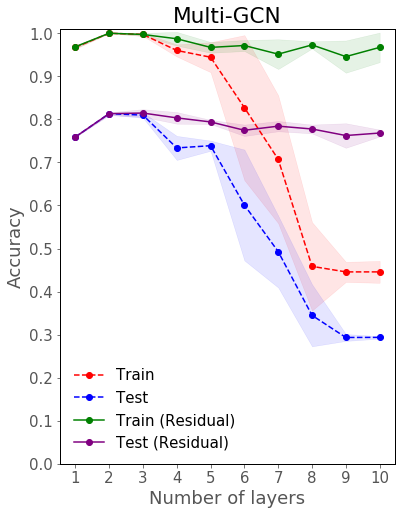

# Graph Convolutional Networks


## Reproduce

| Dataset | Citeseer | Cora | Pubmed |
| :-: | :-: | :-: | :-: |
| Accuracy | ? | 81.5 | ? |

Use the following command to train a GCN model trained on Cora dataset with default parameters to reproduce the result in the paper: [Semi-supervised Classification With Graph Convolutional Networks](https://openreview.net/pdf?id=SJU4ayYgl).

```
$ python train.py accuracy --dataset Cora  --gpu True
```

Once the training is completed, there would be a model file and an image called `gcn.png` which visualizes loss and accuracy during the training. The accuracy on test set can be seen at the tail of output on your terminal.



## Multi-layer GCN

Use the following command to train a multi-layer GCN model with or without residual connections:

```
$ python train.py layers --dataset Cora  --gpu True
```

