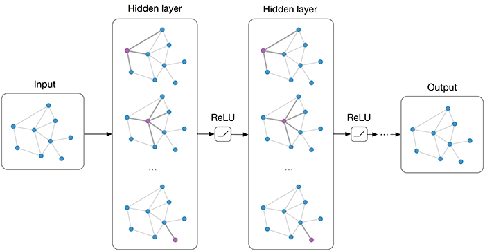

# Graph Convolutional Networks



## How does GCN work?


## Results

| Dataset | Test Accuracy | Reported Accuracy |
| :-: | :-: | :-: |
| Cora | 81.1 +- 0.6% | 81.5 |
| Citeseer | 71.3 +- 0.5% | 70.3 |
| Pubmed | 79.0 +- 0.6% | 79.0 |

## Reproduce

Use the following command to train a GCN model trained on Cora dataset with default parameters to reproduce the result in the paper: [Semi-supervised Classification With Graph Convolutional Networks](https://openreview.net/pdf?id=SJU4ayYgl).

```
$ python train.py accuracy --dataset=cora  --gpu=True
```

You can set different dataset in the argument `--dataset` to reproduce other results. See help for more setting.

Once the training is completed, there would be a model file called `gcn_{dataset}.pth`, and an image called `gcn_{dataset}.png` which visualizes loss and accuracy during the training. The accuracy on test set can be seen at the tail of output on your terminal.


## Multi-layer GCN

Use the following command to train a multi-layer GCN model with or without residual connections:

```
$ python train.py layers --dataset=cora  --gpu=True
```

It will train two multi-layer GCN models, one with residual connections and the other without residual connections.

Once the training is done, an image showing the different between these two models will be saved as `multi_gcn.png`.


The experiment shows that the original GCN can not be stacked to get too many layers. It is even worse when layers are too many. Adding residual connections can decrease the effect, however, no increase is observed.
